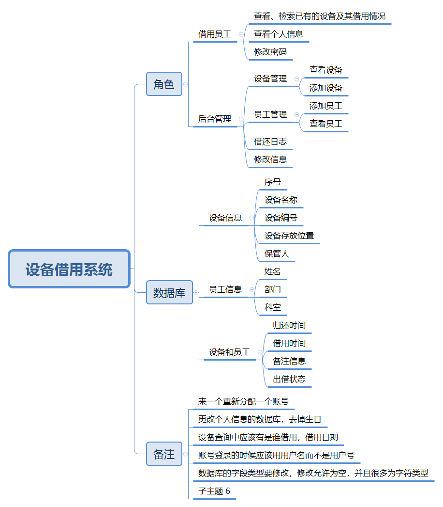

<div style="display: flex; justify-content: space-between;">
  <div>
    <h1>陆兴</h1>
  </div>
  </div>

## 个人信息

* 性 别：男&emsp;&emsp;&emsp;&emsp;&emsp;&emsp;&emsp;&emsp;&emsp;&emsp;&emsp;&emsp;&ensp;年 龄：25  
* 手 机：13041941906 &emsp;&emsp;&emsp;&emsp;&emsp;&emsp;&ensp;  邮 箱：[lx08163356@gmail.com](mailto:ko.momo@qq.com)    
* 专 业：计算机科学与技术 &emsp;&emsp;&emsp;&emsp;&emsp; 岗 位：研发工程师

## 工作及教育经历

* 海信集团  &emsp;&emsp;&emsp;&emsp;&emsp;&emsp;&ensp;2020.8~至今  &emsp;&emsp;&emsp;&emsp;&emsp; 日本业务开发部        
* 中国矿业大学&emsp;&emsp;&emsp;&emsp;&emsp;2016.09 - 2020.06&emsp;&emsp;&emsp;&emsp; 计算机科学与技术专业         

## 专业技能

* 熟练使用 C++，掌握Go，了解 Java、Python、PHP 等编程语言
* 掌握基础数据结构和算法的基本原理
* 等等

## 项目经历

海信-[日本Toshiba电视前端系统设计]<span class="role">:&nbsp;职责：前端开发工程师</span> <span margin-right="0">2022.02 - 2023.07</span>

- 技术栈：**vue3、vite、git、canvas、HTML、CSS、js、linux、git**
- 业务简述：为提高效率、快速响应需求，海信团队替换日本团队业务，重新设计、开发日本已维护了十几年的陈旧的电视前端系统。
- 业务挑战：电视业务量庞大，重新架构难度巨大，需要短时间内同时满足功能和性能要求
- 业务亮点：
- 做出贡献

---

海信-日本Toshiba电视前端系统设计<span class="role">:&nbsp;职责：前端开发工程师</span> <span class="right">2022.02 - 2023.07</span>

- 技术栈：**vue3、vite、git、canvas、HTML、CSS、js、linux、git**
- 业务简述：为提高效率、快速响应需求，海信团队替换日本团队业务，重新设计、开发日本已维护了十几年的陈旧的电视前端系统。
- 业务挑战：电视业务量庞大，重新架构难度巨大，需要短时间内同时满足功能和性能要求
- 业务亮点：
- 做出贡献

## 获奖经历

* 23年两季度评A
* 计算机学院学生优秀干部
* 计算机学院奖学金

## 个人账号

* blog 地址 (附加自己博客特色，写了哪些技术文章)
* github 地址 (附加自己github特色，突出的项目)

## 其他信息

* 喜欢钻研技术 等等
* 性格开朗，喜欢跳舞，做个主持人 等等 
全链路引进：


::: cardList 1
```yaml
- name: 测试设备借用系统图片加载
  desc: 测试图片加载
  link: '/markmap/设备借用系统.png'
  bgColor: "#900C3F"
  textColor: '#2A3344'
```
:::

[//]: # "尝试用dist路径引img用: "

尝试用项目路径引用：
尝试路由引用：<router-link to='/pages/97f1fe/'>测试</router-link>

