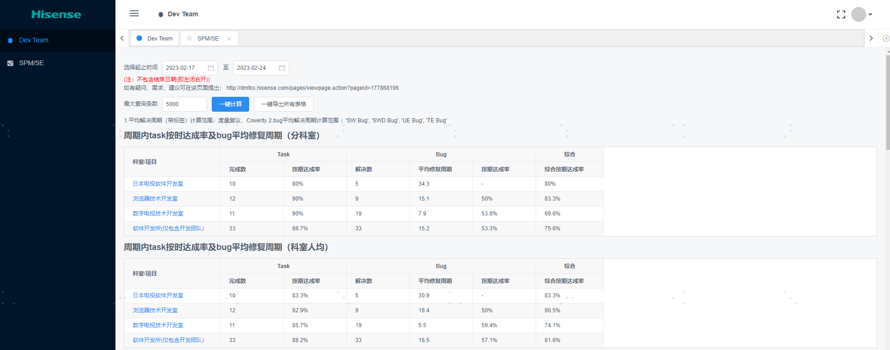
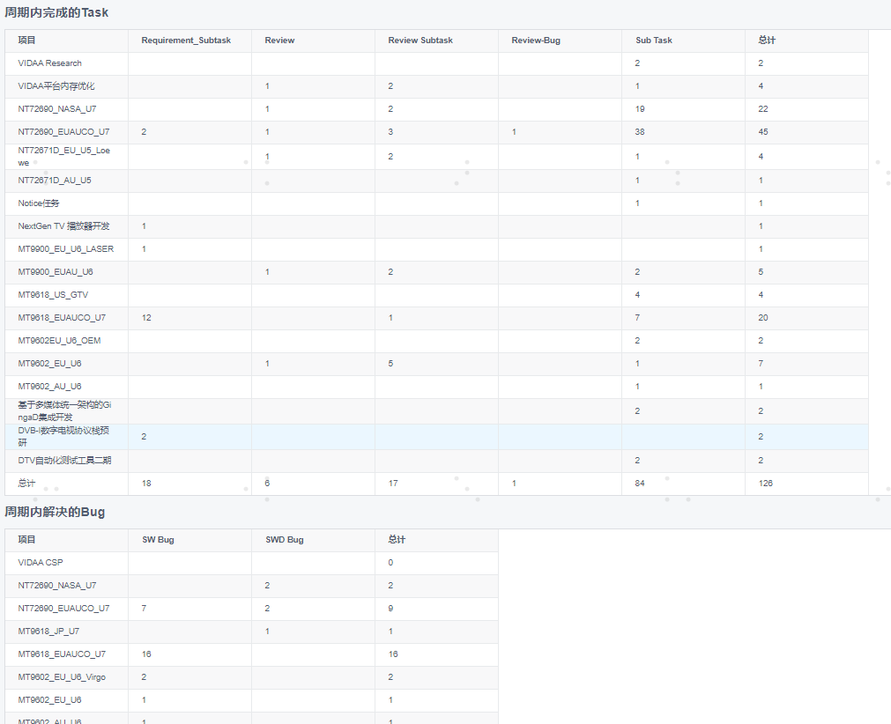
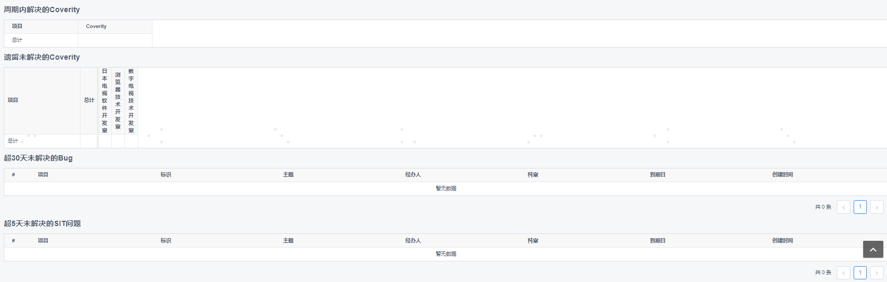
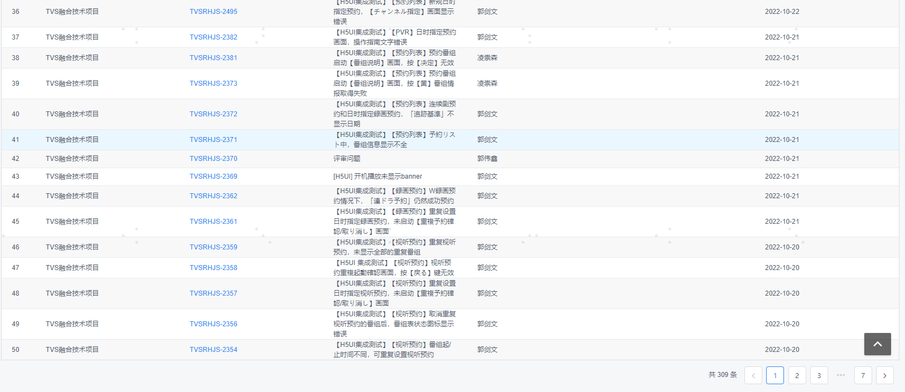
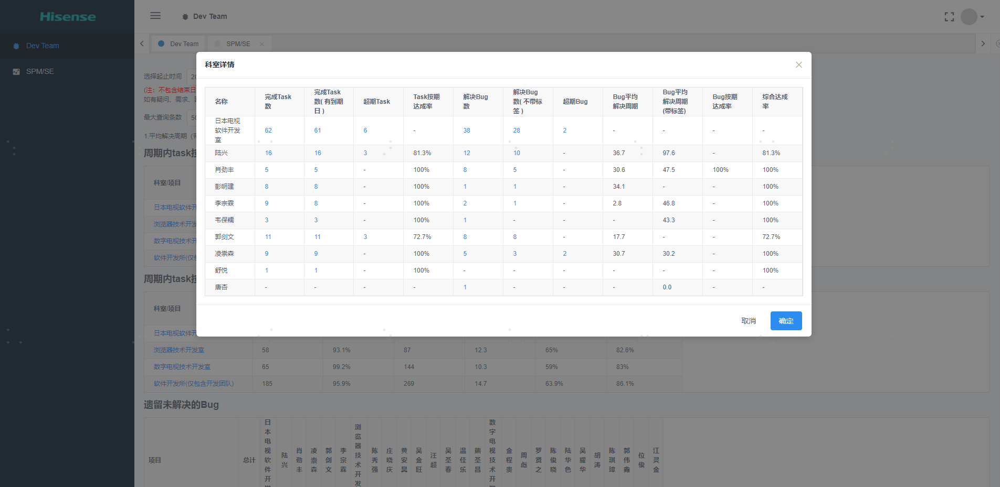

## 零、概要

| 项目名称 | 绩效管理系统                                                 |
| :------- | :----------------------------------------------------------- |
| 前端人数 | 1人                                                          |
| 个人职责 | 项目owner                                                    |
| 技术栈   | **echart、vue2、HTML、CSS、js、linux、git、devtool、python** |
| 项目时间 | 三周+后期长期维护                                            |
| 场景分类 |                                                              |

## 一、项目背景

为总监、经理、项目管理、团队成员开发一套绩效分析工具，帮助他们从jira中快速获取并分析个人、团队绩效表现，从而辅助决策。

## 二、成果展示

### 成果描述

1.功能。开发面向员工和面向领导、管理的模块。实现了遗留bug分析、bug解决周期周期内未解决的bug等**10+功能**的查询、分析、展示。

2.效率提升。由以往的人工搜索、分析、计算的约**3人/天提升到30s以内**

### 代码示例（已脱敏）

todo

### 成果图片

 
 
 
 
 
 
 
 
 

## 三、个人收获

| 概览     | 收获                                                         | 备注 |
| -------- | ------------------------------------------------------------ | ---- |
| 技术     | 1.提升了代码熟练度。如vue组件使用、调度、python打包     |      |
| 框架     | 1.熟练使用vue2。能使用vue框架快速开发页面 2.熟练使用echart部分图表功能 |      |
| 工程能力 | 1.培养了良好的代码风格、编程习惯及文档编写能力，注重代码质量。 2.磨练了工程能力。独立完成从需求分析、项目架构、需求实现、自测试、bug修改、打包成exe、后期维护的完整链路 |      |
| 协作能力 | 1.极大提升了沟通协作能力。与项目管理、总经理、总监、团队成员顺利沟通交流，对需求进行过滤、筛选、计划并开发完成 |      |

## 提取到简历：降本增效项目

公司降本增效项目合集  职责：项目负责人  2021.7-2023.8

- 技术栈：**echart、vue2、HTML、CSS、js、linux、git、devtool、python、selenium、c++**

- 业务描述：发掘出日常开发中各部门效率低下、费用高昂的工作，立项去解决工序上的瓶颈时间。

- 个人贡献：

  1.使用依图框架结合echart/vue2，独立开发出涵盖员工、总经理、项目管理、总监、组长共**5个实体**、包含**数十个功能**的绩效分析系统，效率从**3人/天提升到30s以内**

  2.采用selenium、pyhthon结合linux、devtool开发自动化测试套件，人力**5人/天缩短到0.5人/天**，减少了单期认证费用**60w+**，该项目获得**集团级优秀项目**

  3.开发bat脚本，批量设置**数十个**码流信息并自启动，提升效率**数十倍**；编写vba脚本完成LIT/SIT中**10+表格**中**数千条测试结果**，自动筛选和对比，效率从**1人天提升至30s**；结合github的java web项目完成基于公司物料的借还管理系统开发，解决了设备借寄混乱的问题。
